# DelivTrack — 外卖配送实时监控与运营管理系统

## 连接信息

| 项目 | 地址 |
|------|------|
| GitHub | https://github.com/Marshmellond/DelivTrack |
| Flink WebUI | http://192.168.157.121:8081 |
| MySQL | 192.168.157.122:3306 / root / 123456 / delivery_dashboard |
| Kafka | 192.168.157.121:9092, 192.168.157.122:9092, 192.168.157.123:9092 |
| Redis | 192.168.157.123:6379 / 123456 |

## 账号

| 用户名 | 密码 | 角色 |
|--------|------|------|
| `user_0000` ~ `user_0004` | `123456` | 管理员 |
| `user_0005` ~ `user_0999` | `123456` | 普通用户 |

## 截图

### 基础设施

| Flink WebUI 运行 Job |
|----------------------|
| 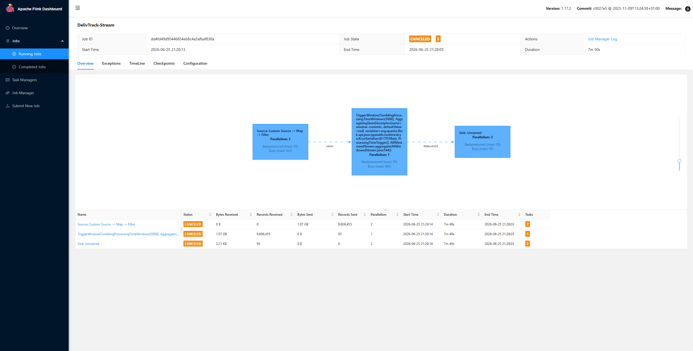 |

### 数据中心

| 页面 | 截图 |
|------|------|
| 实时看板 `/dashboard` | 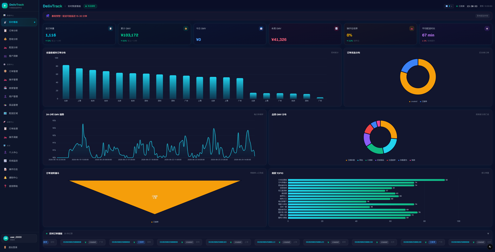 |
| 订单分析 `/analytics/orders` | 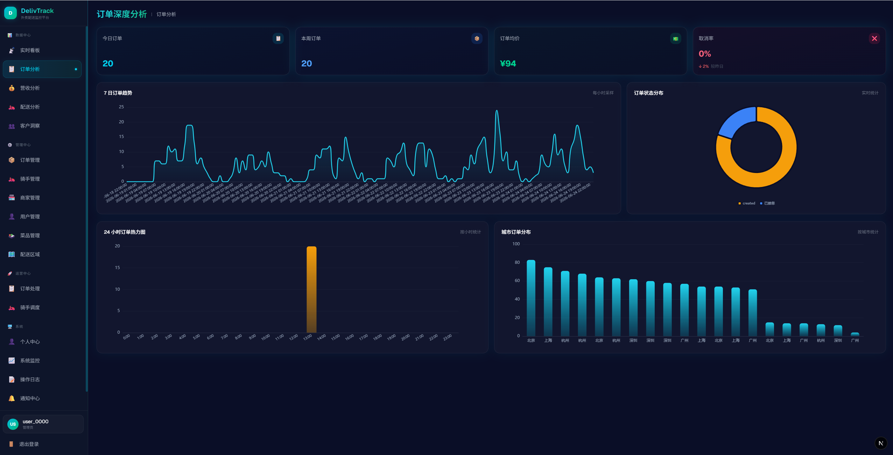 |
| 营收分析 `/analytics/revenue` | 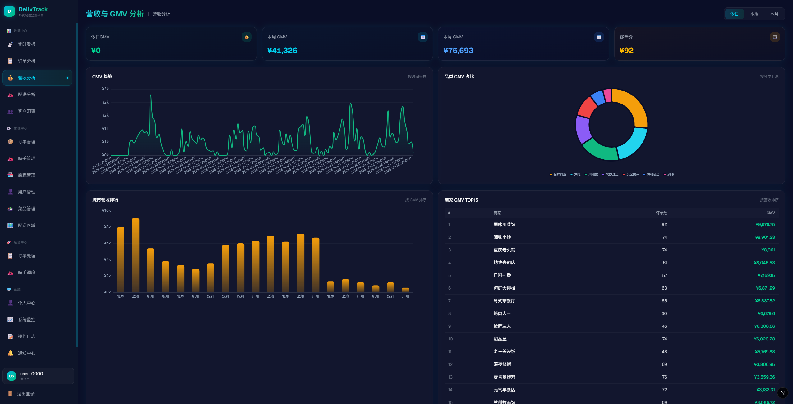 |
| 配送分析 `/analytics/delivery` | 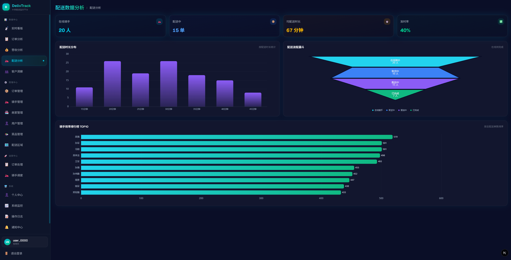 |
| 客户洞察 `/analytics/customers` | 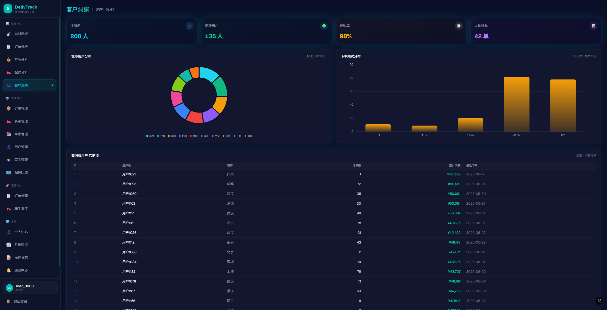 |

### 管理中心

| 页面 | 截图 |
|------|------|
| 订单管理 `/manage/orders` | 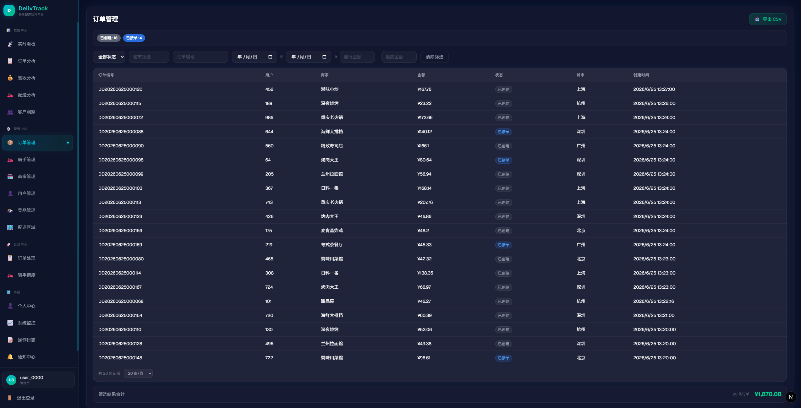 |
| 骑手管理 `/manage/riders` | 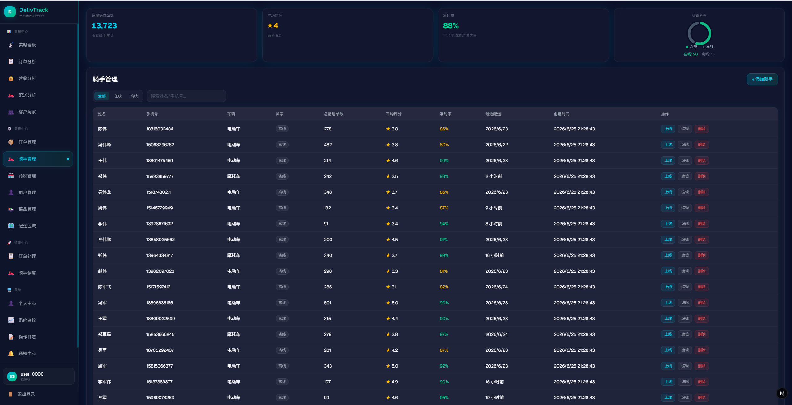 |
| 商家管理 `/manage/merchants` | 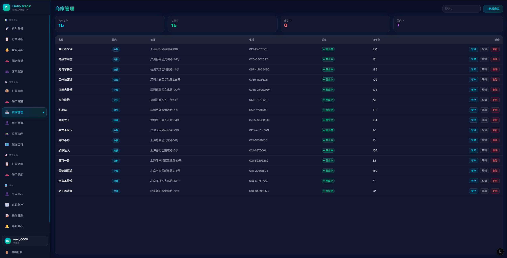 |
| 用户管理 `/manage/users` | 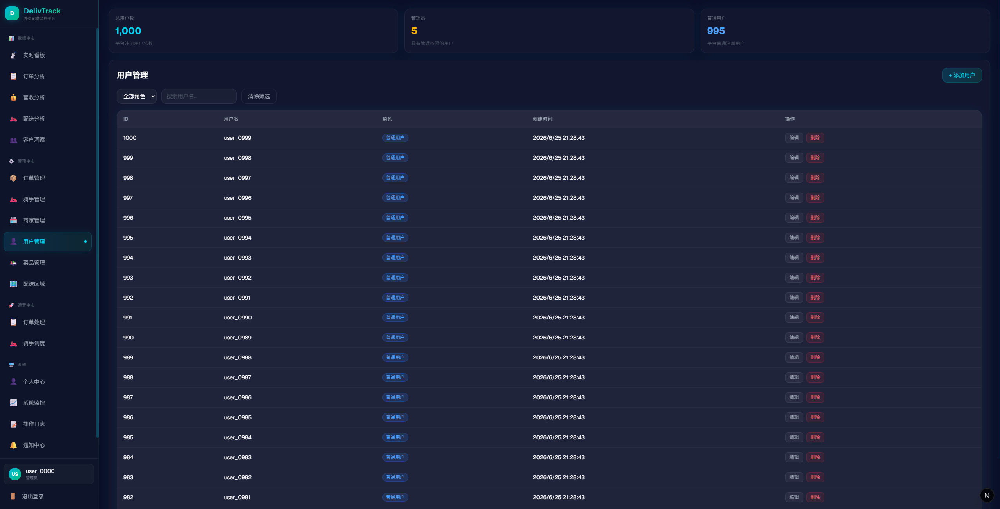 |
| 菜品管理 `/manage/menu` | 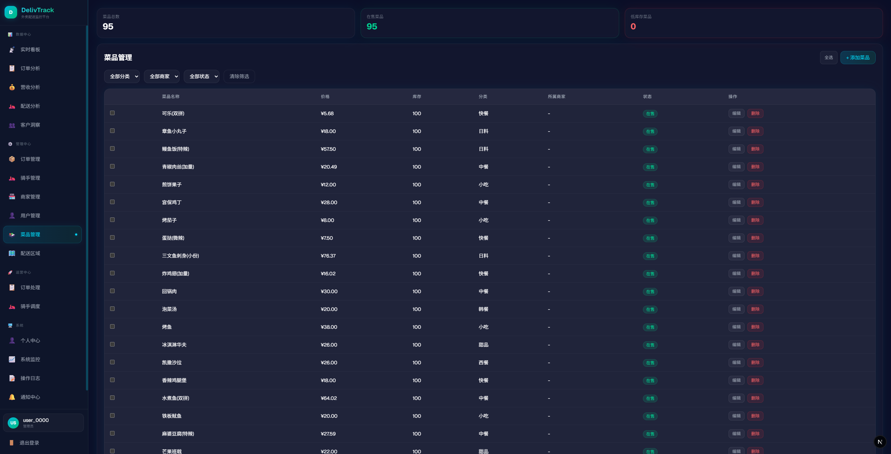 |
| 配送区域 `/manage/zones` | 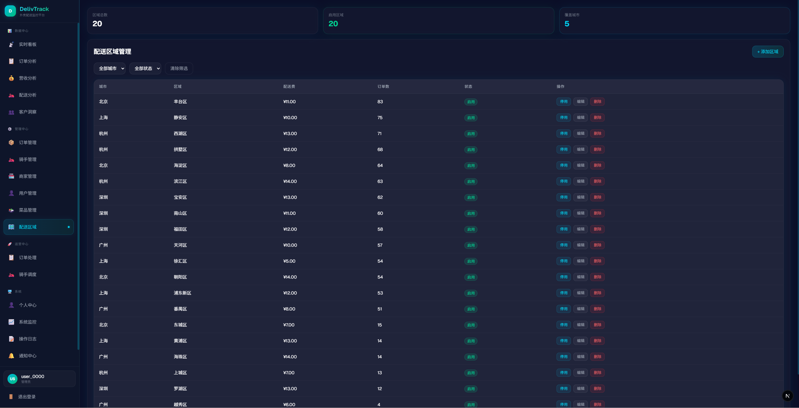 |

### 运营中心

| 页面 | 截图 |
|------|------|
| 订单处理 `/operations/orders` | 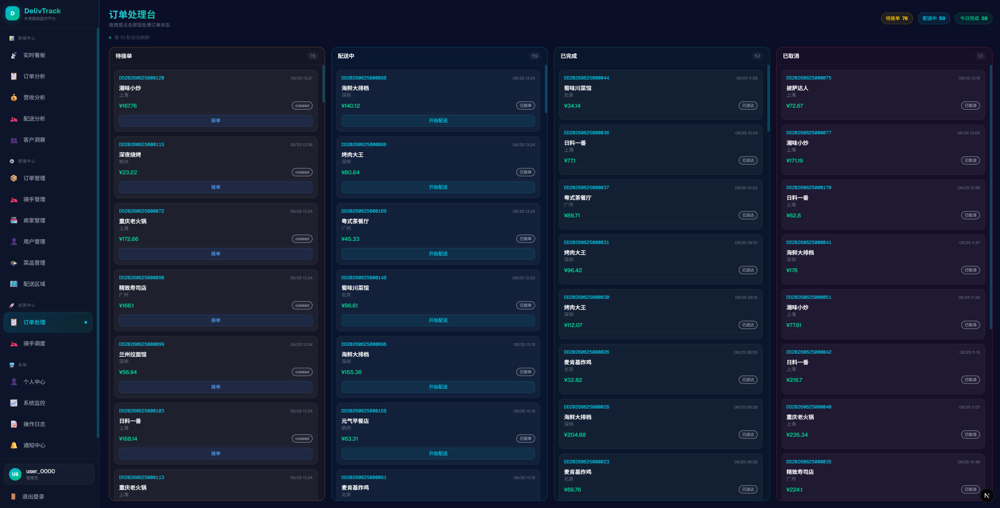 |
| 骑手调度 `/operations/dispatch` | 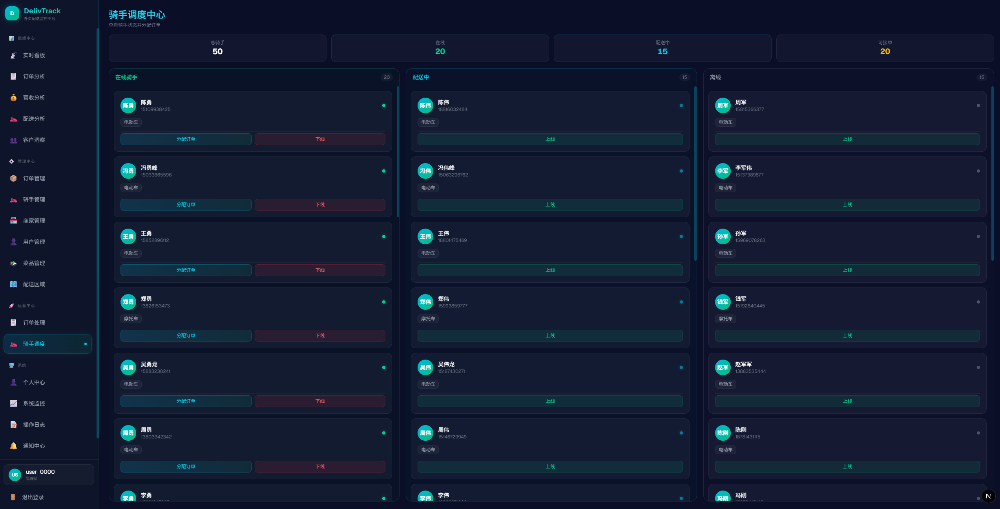 |

### 系统

| 页面 | 截图 |
|------|------|
| 系统监控 `/monitor` | 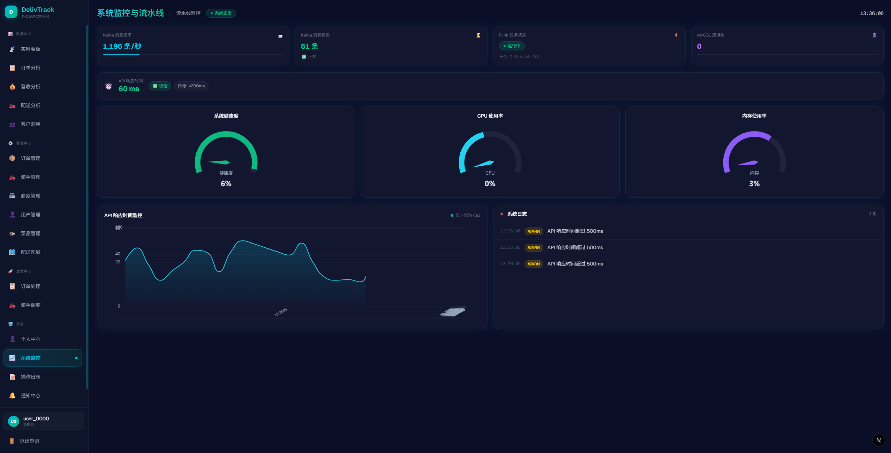 |
| 操作日志 `/system/logs` | 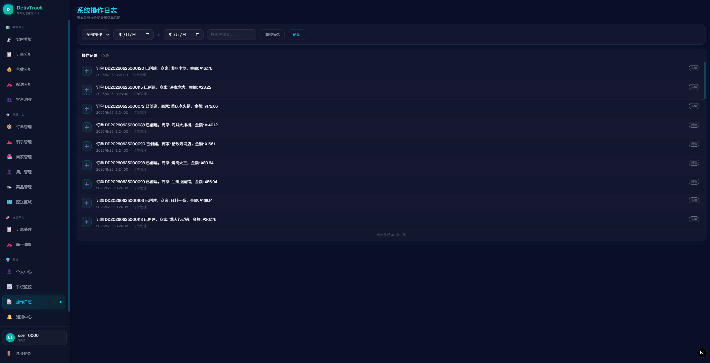 |
| 通知中心 `/notifications` | 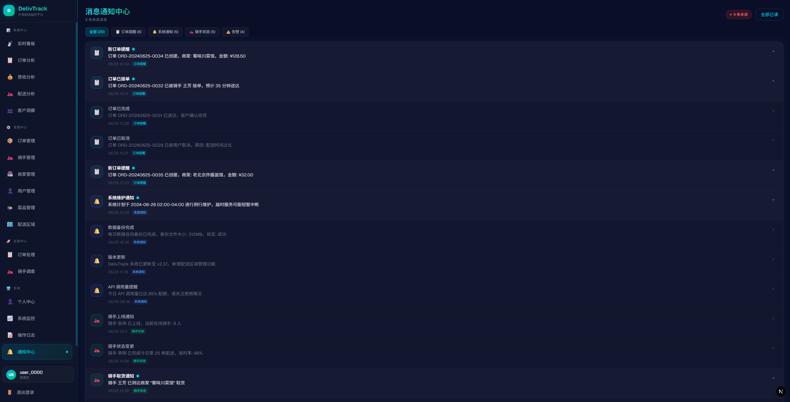 |
| 个人中心 `/profile` | 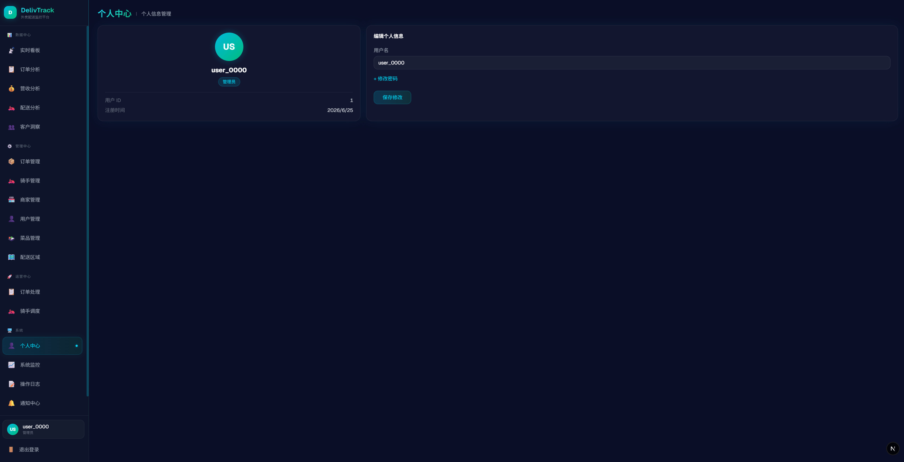 |

### 认证

| 页面 | 截图 |
|------|------|
| 登录 `/login` |  |
| 注册 `/register` |  |

---

## 技术架构

```
Generator(Python) → Kafka(3 Broker) → Flink(5s窗口) → MySQL(9表)
                                                           ↓
Next.js(18页面) ← FastAPI(40+接口) ←─────────────────────┘
```

## 快速启动

```bash
# 1. 集群
ssh root@192.168.157.121 && start-all.sh

# 2. Flink JAR（IDEA Maven clean package）
# 打开 http://192.168.157.121:8081 → Submit JAR

# 3. 种子数据（首次）
cd server && uv run python seed_full_data.py

# 4. 本地服务（3 终端）
cd generator && uv run python simulator/run.py
cd server && uv run uvicorn api.main:app --host 0.0.0.0 --port 8000 --reload
cd web && pnpm dev

# 5. 打开
http://localhost:3000
```

## 子项目文档

| 子项目 | 文档 |
|--------|------|
| generator | [generator/README.md](generator/README.md) |
| flink | [flink/README.md](flink/README.md) |
| server | [server/README.md](server/README.md) |
| web | [web/README.md](web/README.md) |
